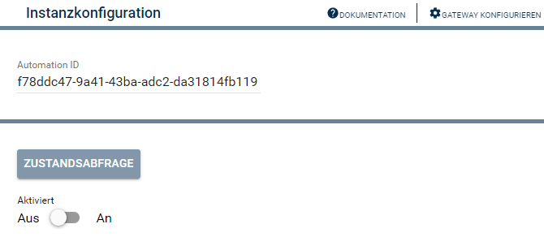

[](https://www.symcon.de/service/dokumentation/entwicklerbereich/sdk-tools/sdk-php/)
[](https://community.symcon.de/t/modul-bosch-smarthome-system-beta/138205)
[](https://www.symcon.de/de/service/dokumentation/installation/migrationen/v80-v81-q3-2025/)   
[](https://creativecommons.org/licenses/by-nc-sa/4.0/)
[](https://github.com/Nall-chan/BoschSHC/actions)
[](https://github.com/Nall-chan/BoschSHC/actions)  
[](#2-spenden)[](#2-spenden)  

# Bosch SmartHome Automatisierungsregel <!-- omit in toc -->
Anzeige und Steuerung einer Bosch SmartHome Automation

## Inhaltsverzeichnis <!-- omit in toc -->

- [1. Funktionsumfang](#1-funktionsumfang)
- [2. Voraussetzungen](#2-voraussetzungen)
- [3. Software-Installation](#3-software-installation)
- [4. Einrichten der Instanzen in IP-Symcon](#4-einrichten-der-instanzen-in-ip-symcon)
- [5. Statusvariablen](#5-statusvariablen)
- [6. PHP-Funktionsreferenz](#6-php-funktionsreferenz)
- [7. Aktionen](#7-aktionen)
- [8. Anhang](#8-anhang)
  - [1. Changelog](#1-changelog)
  - [2. Spenden](#2-spenden)
- [9. Lizenz](#9-lizenz)

## 1. Funktionsumfang

* Anzeige und Steuerung einer Bosch SmartHome Automation

## 2. Voraussetzungen

* IP-Symcon ab Version 8.1
* Bosch SmartHome Controller I oder II.

## 3. Software-Installation

* Dieses Modul ist Bestandteil der [Bosch SmartHome-Library](../README.md#4-software-installation).  

## 4. Einrichten der Instanzen in IP-Symcon

 Unter 'Instanz hinzufügen' kann das 'Bosch SmartHome Automatisierungsregel'-Modul mithilfe des Schnellfilters gefunden werden.  
 - Die Einrichtung sollte durch das anlegen einer [Bosch SmartHome Konfigurator](../Bosch%20SmartHome%20Configurator/README.md)-Instanz erfolgen.   
 - Weitere Informationen zum Hinzufügen von Instanzen in der [Dokumentation der Instanzen](https://www.symcon.de/service/dokumentation/konzepte/instanzen/#Instanz_hinzufügen)  

### Konfigurationsseite: <!-- omit in toc -->

  

| Name             | Text          | Typ    | Beschreibung     |
| ---------------- | ------------- | ------ | ---------------- |
| AutomationRuleId | Automation ID | string | Adresse der Rule |

## 5. Statusvariablen

| Name                   | Typ  | Profil  | Beschreibung         |
| ---------------------- | ---- | ------- | -------------------- |
| AutomationRule_enabled | bool | ~Switch | Automation aktiviert |


## 6. PHP-Funktionsreferenz

```php
bool BSHC_RequestState(integer $InstanzID);
```
Aktuellen Status auslesen.  

---

```php
bool BSHC_EnableAutomationRule(integer $InstanzID, bool $Active);
```
Automation aktivieren (`true`) oder deaktivieren (`false`).  

## 7. Aktionen

Keine Aktionen verfügbar.

## 8. Anhang

### 1. Changelog

[Changelog der Library](../README.md#2-changelog)

### 2. Spenden

Die Library ist für die nicht kommerzielle Nutzung kostenlos, Schenkungen als Unterstützung für den Autor werden hier akzeptiert:  

<a href="https://www.paypal.com/donate?hosted_button_id=G2SLW2MEMQZH2" target="_blank"></a>  

[](https://www.amazon.de/hz/wishlist/ls/YU4AI9AQT9F?ref_=wl_share) 

## 9. Lizenz

  IPS-Modul:  
  [CC BY-NC-SA 4.0](https://creativecommons.org/licenses/by-nc-sa/4.0/)  