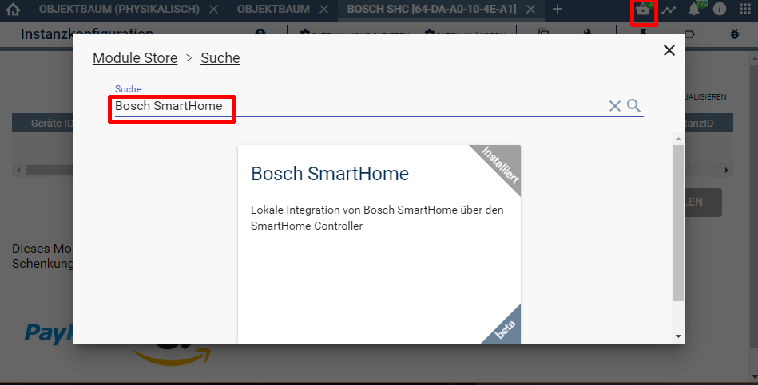
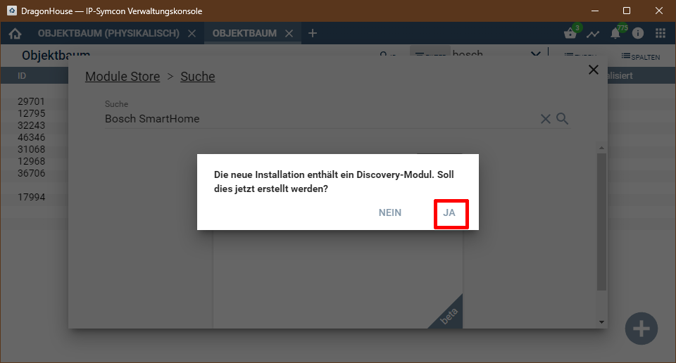
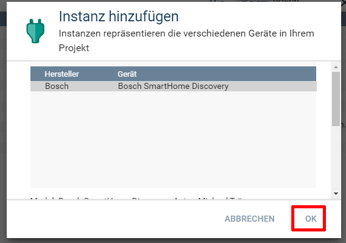
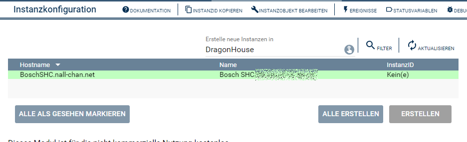

  

  
  

# Bosch Smart Home <!-- omit in toc -->

Lokale*1 Anbindung des Bosch SmartHome Systems an Symcon.  
*1) Gilt nicht für die HomeConnect Geräte und die Kameras  

## Inhaltsverzeichnis <!-- omit in toc -->
- [1. Vorbemerkungen](#1-vorbemerkungen)
- [2. Voraussetzungen](#2-voraussetzungen)
- [3. Enthaltende Module](#3-enthaltende-module)
- [4. Software-Installation](#4-software-installation)
- [5. Einrichten der Instanzen in IP-Symcon](#5-einrichten-der-instanzen-in-ip-symcon)
- [6. Anhang](#6-anhang)
	- [1. GUID der Module](#1-guid-der-module)
	- [2. Changelog](#2-changelog)
	- [3. Spenden](#3-spenden)
- [6. Lizenz](#6-lizenz)

## 1. Vorbemerkungen

----------
## 2. Voraussetzungen

* IP-Symcon ab Version 8.1
* Bosch SmartHome Controller I oder II.
 
## 3. Enthaltende Module

- __Bosch SmartHome Discovery__ ([Dokumentation](Bosch%20SmartHome%20Discovery/README.md))  
	Kurze Beschreibung des Moduls.

- __Bosch SmartHome Konfigurator__ ([Dokumentation](Bosch%20SmartHome%20Configurator/README.md))  
	Kurze Beschreibung des Moduls.

- __Bosch SmartHome IO__ ([Dokumentation](Bosch%20SmartHome%20IO/README.md))  
	Kurze Beschreibung des Moduls.

- __Bosch SmartHome Device__ ([Dokumentation](Bosch%20SmartHome%20Device/README.md))  
	Kurze Beschreibung des Moduls.

- __Bosch SmartHome Automatisierungsregel__ ([Dokumentation](Bosch%20SmartHome%20Automation%20Rule/README.md))  
	Kurze Beschreibung des Moduls.

- __Bosch SmartHome Türen und Fenster__ ([Dokumentation](Bosch%20SmartHome%20Doors%20and%20Windows/README.md))  
	Kurze Beschreibung des Moduls.

- __Bosch SmartHome Meldungen__ ([Dokumentation](Bosch%20SmartHome%20Messages/README.md))  
	Kurze Beschreibung des Moduls.

- __Bosch SmartHome Szenarien__ ([Dokumentation](Bosch%20SmartHome%20Scenarios/README.md))  
	Kurze Beschreibung des Moduls.

- __Bosch SmartHome System__ ([Dokumentation](Bosch%20SmartHome%20System/README.md))  
	Kurze Beschreibung des Moduls.

- __Bosch SmartHome Wateralarm System__ ([Dokumentation](Bosch%20SmartHome%20Wateralarm%20System/README.md))  
	Kurze Beschreibung des Moduls.

## 4. Software-Installation
  
  Über den 'Module-Store' in IPS das Modul 'Bosch SmartHome' hinzufügen.  
   **Bei kommerzieller Nutzung (z.B. als Errichter oder Integrator) wenden Sie sich bitte an den Autor.**  
 

## 5. Einrichten der Instanzen in IP-Symcon
 Details sind direkt in der Dokumentation der jeweiligen Module beschrieben.
 Es wird empfohlen die Einrichtung mit der Discovery-Instanz zu starten [Bosch SmartHome Discovery](/Bosch%20SmartHome%20Discovery/README.md).
 Nach der installation aus dem Store wird diese Instanz auf Rückfrage automatisch angelegt.
  
  
Wurde der Bosch SmartHome Controller im Netzwerk gefunden, so wird er in der [Bosch SmartHome Discovery](/Bosch%20SmartHome%20Discovery/README.md)-Instanz angezeigt.  
  

## 6. Anhang

###  1. GUID der Module

| Modul                                 |     Typ      | Prefix | GUID                                   |
| :------------------------------------ | :----------: | :----: | :------------------------------------- |
| Bosch SmartHome Discovery             |  Discovery   |  BSHC  | {98281B33-2867-4A31-9D21-DFEC24D4ECCF} |
| Bosch SmartHome Konfigurator          | Konfigurator |  BSHC  | {D9479A03-8726-B4E2-FFD1-2CC390CFE166} |
| Bosch SmartHome IO                    |      IO      |  BSHC  | {8D1D21A7-FDE3-EB16-B5B3-6D38D0673B62} |
| Bosch SmartHome Gerät                 |    Gerät     |  BSHC  | {6595716D-84D6-807C-E0E8-365568AD8217} |
| Bosch SmartHome System                |    Gerät     |  BSHC  | {100F2205-145A-434E-BAF1-6FD64528A6BA} |
| Bosch SmartHome Wasseralarm-System    |    Gerät     |  BSHC  | {C2EF63F8-549A-43B2-B51E-5170129E84CB} |
| Bosch SmartHome Automatisierungsregel |    Gerät     |  BSHC  | {10999DC2-2A1E-4D34-95BB-885CD9B7F584} |
| Bosch SmartHome Szenarien             |    Gerät     |  BSHC  | {6E721ADA-F07D-4C17-9BAD-AC2087DE2F74} |
| Bosch SmartHome Meldungen             |    Gerät     |  BSHC  | {02661809-F3CE-4D12-95B0-C81123084A12} |
| Bosch SmartHome Türen und Fenster     |    Gerät     |  BSHC  | {1080892A-31C2-4234-A1FB-D88E6C14118C} |

----------
### 2. Changelog

**Version 1.20:**  
- Version für Symcon 8.1 und neuer  
- Durchgängige Nutzung von Darstellungen anstatt von Profilen  
  
**Version 1.10:**  
- Setzen des Betriebsmodus von RoomClimateControl war fehlerhaft  
  
**Version 1.00:**  
- Diverse Rückmeldungen von Funktionen ergänzt  
- Dokumentation erstellt  
- Umrechnung Leistung war um den Faktor 1000 falsch  
- Bei Lizenzwechsel war keine Verbindung mit dem Controller mehr möglich  
- Neu Koppel Funktion ergänzt, nach Lizenzwechsel  

**Version 0.70:**  
- Beta Release für Symcon 7.0  

----------
### 3. Spenden  
  
  Die Library ist für die nicht kommerzielle Nutzung kostenlos, Schenkungen als Unterstützung für den Autor werden hier akzeptiert:  

## 6. Lizenz

  IPS-Modul:  
  [CC BY-NC-SA 4.0](https://creativecommons.org/licenses/by-nc-sa/4.0/)  